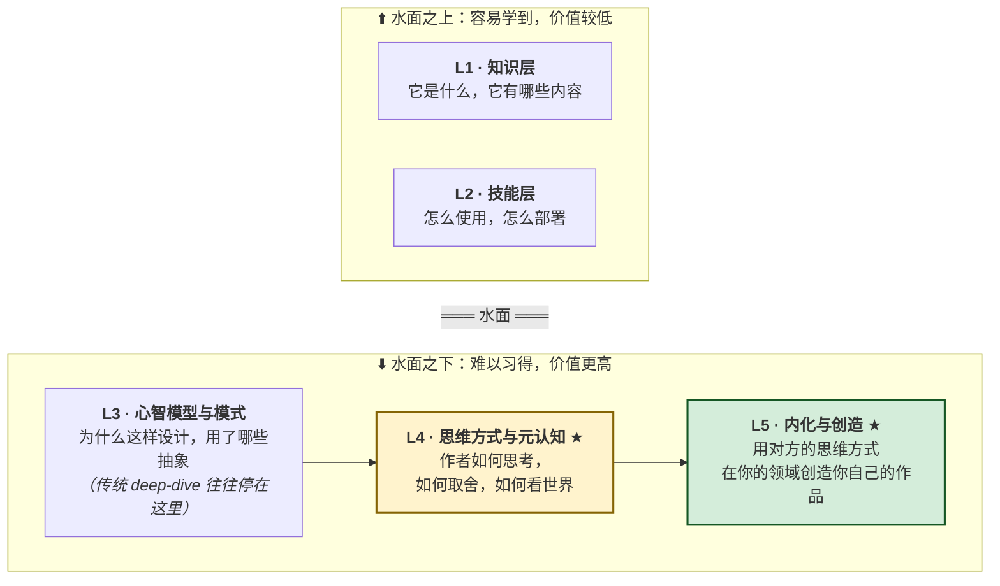
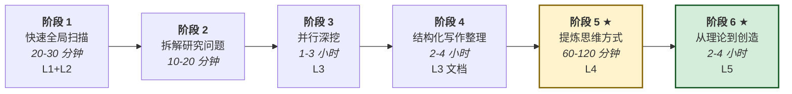

# Repo Deep Dive 🧊

> **一个用于深度内化开源仓库的 Claude Code / Cowork Skill。**
> 它不只回答“这个仓库是做什么的”，还帮助你提炼出作者的**思维方式**、决策框架，并在你自己的领域里创造新的东西。
> 别再只是读 README，开始真正内化作者的思维方式。

快速导航：[快速开始](#-快速开始) · [冰山模型](#-冰山模型) · [工作流](#-6-阶段工作流) · [文档](#-文档) · [安装](#-安装)

---

## ⚡ TL;DR

大多数“深度拆解”最终都停在了**第 3 层（设计模式）**。这个 skill 会继续把你推进到**第 4 层（作者的思维方式）**，再到**第 5 层（用这种思维方式创造你自己的作品）**。因为在 AI 时代：

> [!IMPORTANT]
> **第 1 到第 3 层已经被 AI 大幅降本，真正的人类价值正在迁移到第 4 和第 5 层。**
> 知识 → 问 AI。模式 → 让 AI 提炼。**思维方式 → 只有人能真正吸收、重组并转化。**

---

## 📑 目录

- [为什么会有这个 Skill](#-为什么会有这个-skill)
- [冰山模型](#-冰山模型)
- [6 阶段工作流](#-6-阶段工作流)
- [运行后你会得到什么](#-运行后你会得到什么)
- [安装](#-安装)
- [快速开始](#-快速开始)
- [使用示例](#-使用示例)
- [项目结构](#-项目结构)
- [文档](#-文档)
- [适用场景](#-适用场景)
- [4 条创造路径](#-4-条创造路径)
- [7 种思维方式提炼方法](#-7-种思维方式提炼方法)
- [反模式](#反模式)
- [路线图](#-路线图)
- [贡献方式](#-贡献方式)
- [致谢](#-致谢)
- [许可证](#-许可证)

---

## 🤔 为什么会有这个 Skill

读 README.md，你知道一个仓库“做什么”。
跑一遍教程，你知道它“怎么用”。
翻源码，你知道它的“架构长什么样”。

**但你依然做不出一个像它那样的东西。**

因为真正定义一个优秀产品的，往往不是表层功能，而是作者的**思维方式**：他们如何理解问题、如何划定取舍边界、哪些事他们明确拒绝去做。这些决定往往藏在 git log、提交说明，以及代码中那些“刻意没有出现”的部分里，而不是摆在表面。

> [!NOTE]
> **这个 skill 的目标，是让你逐步变成“本来就能做出它的人”那种思考者**，然后再把这种思考方式迁移到你自己的领域里，做出新的东西。

---

## 🧊 冰山模型



| 层级 | 来源 | 难度 | 遗忘速度 |
| :--: | --- | :--: | :--: |
| **L1** 知识 | README、文档 | ⭐ | 24 小时内忘掉 80% |
| **L2** 技能 | 教程、示例 | ⭐⭐ | 需要靠练习保持 |
| **L3** 模式 | 代码组织、命名 | ⭐⭐⭐ | 用得多就能留下来 |
| **L4** 思维方式 | git log、缺失之处、注释 | ⭐⭐⭐⭐ | 一旦内化就更持久 |
| **L5** 创造 | 用这种思维方式做你自己的作品 | ⭐⭐⭐⭐⭐ | 这才是真正的产出 |

---

## 🛠 6 阶段工作流



> [!TIP]
> 第 1 到第 4 阶段是必要的准备。**真正的学习发生在第 5 和第 6 阶段。** 跳过这两步，是最常见也最致命的失败模式。

---

## 📦 运行后你会得到什么

你会获得一个 .learning-notes/ 目录，里面是 **10+ 份可直接公开分享的结构化文档**，每份都带有目标层级标签：

```text
.learning-notes/
├── README.md                              [索引 + 10 条 TL;DR，并带 [L] 标签]
├── 01-overview.md                         [L1+L2]
├── 02-architecture.md                     [L3]
├── 03–N-<core-module>.md                  [L3]
├── M-engineering.md                       [L2+L3]
├── M+1-design-patterns.md                 [L3 — 模式图谱]
├── M+2-mindset-and-philosophy.md          [L4 ★ — 作者的思维方式]
├── M+3-apply-and-creation.md              [L5 ★ — 你的创造路线图]
└── concept-table.md                       [Final synthesis ★ — 概念表 / wikilink 入口]
```

运行结束时还会强制做一次收尾：回写 README 的全局 TL;DR，并生成一份 `concept-table.md`。其他 md 文档第一次出现共享概念时，会回链到这张概念表，形成统一导航入口。

此外，还可以选择生成：

- 📁 一个位于**不同领域**的**种子项目**，用来证明这种思维方式可以迁移
- 📋 一份 **30 / 60 / 90 天路线图**，帮助你把这种思维方式真正用到工作里
- 🧠 一组 **5 到 7 条高度浓缩的思维准则**，用作者本人的语气提炼表达

---

## 🚀 安装

> [!IMPORTANT]
> 需要 [Claude Code](https://claude.com/code) 或 Cowork。这个 skill 本质上就是纯 Markdown，不需要构建步骤。

### 方案 1：全局安装（所有项目都能用）

```bash
mkdir -p ~/.claude/skills
cp -r .learning-notes/_skill-repo-deep-dive ~/.claude/skills/repo-deep-dive
```

### 方案 2：项目级安装（随团队一起提交）

```bash
mkdir -p .claude/skills
cp -r .learning-notes/_skill-repo-deep-dive .claude/skills/repo-deep-dive
git add .claude/skills/repo-deep-dive
git commit -m "feat: install repo-deep-dive skill"
```

### 方案 3：先试用，再决定是否安装

不用安装，直接把它指给 Claude：

```text
Read the skill at .learning-notes/_skill-repo-deep-dive/SKILL.md
and use it to deeply analyze <repo URL>.
```

### 验证

```bash
python3 -m venv /tmp/venv && /tmp/venv/bin/pip install pyyaml -q
/tmp/venv/bin/python3 -c "
import yaml
with open('SKILL.md') as f: text = f.read()
_, fm, _ = text.split('---', 2)
meta = yaml.safe_load(fm)
print(f'✓ name: {meta[\"name\"]}')
print(f'✓ description: {len(meta[\"description\"])}/1024 chars')
"
```

---

## ⚡ 快速开始

1. **挑一个你想真正内化的仓库**，例如 [anthropics/financial-services](https://github.com/anthropics/financial-services)。

2. **在 Claude Code 里输入：**

   ```text
   Use repo-deep-dive to internalize https://github.com/X/Y.
   I care most about the author's mindset, not just the code.
   ```

3. **Claude 会跑完整个 6 阶段流程**。你会在几个关键节点参与：
   - 阶段 1 之后：确认研究范围是否合理
   - 阶段 3 之后：查看并行深挖的结果
   - 阶段 5 之后：阅读并修订“思维方式总结”
   - 阶段 6 之后：决定采用哪条创造路径

4. **输出结果**会落到 .learning-notes/ 目录中。虽然目录名保留了历史叫法，但内容默认按可公开发布的研究文档来写，建议纳入版本控制，而不是默认加入 gitignore。

5. **可选：如果你想自己手动推进每个阶段，也可以先生成骨架**：

   ```bash
   python3 ~/.claude/skills/repo-deep-dive/scripts/scaffold-notes.py \
     /path/to/target-repo \
     --modules "core,plugins,sdk"
   ```

---

## 💡 使用示例

### 示例 1：内化一个多 Agent 框架

```text
Use repo-deep-dive to internalize https://github.com/langchain-ai/langgraph.
Goal: I'm evaluating multi-agent frameworks for our team. I want to understand
not just LangGraph's features, but why the authors chose graph DSL over markdown
contracts (the way Anthropic FSI did it).

Spend extra time on Phase 5 — I want a clear "mindset diff" between LangGraph
and Anthropic FSI.
```

**预期输出**：10 份文档，其中“思维方式”文档会明确对比这两个仓库背后的世界观差异，并额外给出一份创造路径 C（思维方式混合）的方案。

### 示例 2：借走一位优秀作者的结构感

```text
Use repo-deep-dive on https://github.com/excalidraw/excalidraw.
I don't care about the code — I want to understand WHY their README/docs feel
so polished. Focus Phase 5 on documentation mindset, not architecture.
```

**预期输出**：会重点使用思维方式提炼方法 5（价值痕迹）和 6（受众假设）。阶段 6 会为你自己的项目产出一份文档重写计划。

### 示例 3：迁移一套方法论

```text
Use repo-deep-dive on https://github.com/anthropics/financial-services.
Skip Phase 6 path A (too easy). Go straight to path B — apply their
trust-boundary + sole-write-holder mindset to my content-moderation SaaS at
github.com/me/my-app.
```

**预期输出**：一份路径 B 的创造文档，包含完整的重构级架构草图。

---

## 📁 项目结构

```text
_skill-repo-deep-dive/
├── README.md                              ← 你当前就在这里（面向人类）
├── SKILL.md                               ← skill 源文件（面向 LLM）
├── references/
│   ├── mindset-extraction.md              ← 7 种方法 + 完整示例
│   ├── internalization-and-creation.md    ← 4 条创造路径 + 模板
│   ├── explore-prompts.md                 ← 阶段 3 的提示词模板
│   └── document-templates.md              ← 阶段 4 的文档骨架
└── scripts/
    └── scaffold-notes.py                  ← 生成 .learning-notes/ 骨架
```

| 文件 | 行数 | 作用 |
| --- | ---: | --- |
| `SKILL.md` | 455 | 主 skill 定义，会在触发时被 Claude 读取 |
| `references/mindset-extraction.md` | 374 | 7 种思维方式提炼方法，附完整演练示例 |
| `references/internalization-and-creation.md` | 329 | 4 条从学习走向创造的路径，含模板与常见坑 |
| `references/explore-prompts.md` | 195 | 阶段 3 的 7 种 Explore 子 Agent 场景模板 |
| `references/document-templates.md` | 381 | 阶段 4 中 8 类文档的章节骨架 |
| `scripts/scaffold-notes.py` | 532 | 一个可重复执行的 .learning-notes/ 生成器 |

---

## 📚 文档

> [!NOTE]
> 整体设计遵循**渐进式披露**：先读 SKILL.md，只有在你确实需要更深细节时，再进入 references/。

### 核心文档

- **[SKILL.md](SKILL.md)**：主契约文件，读起来更像一份方法论指南。先从这里开始。

### 深层技术参考

- **[references/mindset-extraction.md](references/mindset-extraction.md)**：7 种逆向提炼作者思维方式的方法。每一种都用 anthropics/financial-services 做了完整示例。*这是这个 skill 最核心的技术创新。*

- **[references/internalization-and-creation.md](references/internalization-and-creation.md)**：4 条从学习到创造的路径。A 路径（★）最容易、最常用；D 路径（★★★★）最少见，但也最有威力。

### 操作参考

- **[references/explore-prompts.md](references/explore-prompts.md)**：阶段 3 用来启动 Explore 子 Agent 的提示词模板。共 7 类场景：架构、模块、工程实践、演化、生态、运行时、对比。

- **[references/document-templates.md](references/document-templates.md)**：阶段 4 产出的各类文档章节骨架。

### 工具脚本

- **[scripts/scaffold-notes.py](scripts/scaffold-notes.py)**：生成一个空的 .learning-notes/ 目录，并预填好 10 份文档的章节标题。

---

## 🎯 适用场景

### ✅ 适合在这些情况下触发这个 skill

- 你会说：“我想**内化** / **深入学习** / **拆透** 仓库 X”
- 你会说：“我想**做一个类似 X 的东西**，但先得搞清它的本质”
- 你会说：“帮我理解 X 背后的**思维方式** / **哲学** / **设计思路**”
- 你会说：“我正在**评估** X，想知道这些选择背后的**为什么**”
- 你正在做**技术选型**，需要真正理解其中的深层取舍
- 你正在带团队**上手一个复杂的外部代码库**

### ❌ 不适合在这些情况下使用

- 你只是要**修 bug** / **做 code review** → 用专门的评审工具
- 你只是想让人**解释某个函数** → 直接读就够了
- 你只是想知道**“怎么用库 Y 做 X”** → README 加示例就行
- 你只需要**快速摘要** → 用摘要工具，这个 skill 的目标是深挖
- 你不愿意投入**第 5 到第 6 阶段的时间** → 那么这个流程对你来说就过重了

---

## 🎨 4 条创造路径

阶段 5 帮你提炼出思维方式后，阶段 6 要回答的是：**你准备拿它做什么？**

| 路径 | 难度 | 你要做什么 | 何时适合选择 |
| :--: | :--: | --- | --- |
| **A** 应用迁移 | ⭐ | 保留同样的思维方式，把它应用到你工作中的 5 个问题上 | 刚开始上手，或用于日常学习 |
| **B** 表层置换 | ⭐⭐ | 换技术栈、换行业，但保留核心思维方式 | 你想做一个能展示的作品 |
| **C** 思维方式混合 | ⭐⭐⭐ | 把思维方式 A 和 B 混在一起，形成新的复合设计 | 你已经内化过至少 2 个仓库 |
| **D** 思维方式反转 | ⭐⭐⭐⭐ | 故意反着来，寻找作者那个“影子产品” | 当你在寻找空白机会 |

> [!TIP]
> 先从**路径 A**开始。半年后试试**路径 B**。一年后再做混合。**路径 D** 适合少数真正特殊的项目。

---

## 🧠 7 种思维方式提炼方法

> 完整演练示例见 [references/mindset-extraction.md](references/mindset-extraction.md)。

| # | 方法 | 核心问题 |
| :--: | --- | --- |
| 1 | **“Why NOT” 分析** | 作者明显**没有**做什么？每一个 NOT 都在暴露一种思维方式。 |
| 2 | **演化归因** | 时间顺序 = 优先级顺序 = 思维方式顺序。 |
| 3 | **取舍光谱** | 把作者放到 10 条经典张力轴上定位（简单↔完整、灵活↔严格等）。 |
| 4 | **反事实推理** | “如果作者是博士范、是大公司范、是黑客范、是安全优先范、是 DX 工程师范，他们会做成什么样？”然后做对比。 |
| 5 | **价值痕迹** | 注释、命名、报错信息、文档篇幅比例都会泄露价值观。 |
| 6 | **受众假设** | 作者默认是谁在读？哪些内容没有解释，反而暴露了预设知识背景。 |
| 7 | **第一性原理追踪** | 作者拒绝接受哪些“行业默认设定”？ |

> [!IMPORTANT]
> 不要孤立使用这些方法。**把它们串起来。** 一个来自方法 1 的判断，至少应该再被方法 3、5、7 交叉验证后，才值得写成思维准则。

---

## 反模式

> [!WARNING]
> 这些是最常见的失败方式，会让一次 deep-dive 直接变成无效劳动。

- ❌ **停在第 3 层**：最后只产出“设计模式文档”，没有“思维方式”章节
- ❌ **思维方式章节只有空话**：比如“作者重视简洁”，但没有任何证据
- ❌ **没有 “Why NOT”**：只看作者做了什么，从不看作者拒绝了什么
- ❌ **没有取舍光谱**：只列优点，却不把作者放到真实张力轴上定位
- ❌ **跳过阶段 6**：文档写完就停，思维方式却从未真正被用起来，学习就失败了
- ❌ **抄代码，不抄思维方式**：fork 仓库改个名而已，这只是表层偷取
- ❌ **功能清单堆砌**：看起来很全，实际上什么也没教会你
- ❌ **把所有东西塞进一个超长文档**：5000 行单文件，没人会读
- ❌ **没有层级标签**：所有发现混在一起，读者分不清哪些是表层、哪些是深层
- ❌ **没有 path:line 引用**：结论无法验证，整份文档不可信

---

## 🗺 路线图

计划中的增强方向，也欢迎社区参与：

- 跨仓库思维方式对比助手：一次性在 N 个仓库上执行阶段 5
- 思维方式资料库：沉淀已经研究过的仓库所提炼出的思维准则
- 间隔重复式“思维方式刷新”提示：每周把你的准则重新拉回视野
- 面向非代码仓库的变体：学术论文、设计系统、规范文档等

---

## 🤝 贡献方式

这个 skill 是一套持续演化的方法论，欢迎改进。

### 高价值贡献

- **新的思维方式提炼方法**：并附带完整示例，证明它能挖出原有 7 种方法挖不出的东西
- **适配新类型仓库的变体**：例如学术项目、单文件 gem、数据集、规范文档
- **面向非西方语言的 scaffold 模板**：当前 skill 主要是中英双语
- **经验性结果**：分享一份由这个 skill 产出的 .learning-notes/，让别人能反向审视方法是否有效

### 价值较低的贡献

- 再加更多阶段流程（阻力本身就是设计的一部分）
- 引入框架依赖（只用 markdown + python 标准库是刻意选择）
- 逐字直译整个 skill（更好的方式是把“思维模式”本地化，而不是照抄）

### 如何贡献

1. Fork 仓库
2. 在一个你真正在意的仓库上跑这套 skill
3. 如果 skill 在某个具体点上失效了，提 issue，并附上 .learning-notes/ 片段和失效的方法说明
4. 如果你有改进，提 PR。尽量保持 diff 小，并通过重新运行 scaffold-notes.py 做验证

---

## 🙏 致谢

这个 skill 站在这些肩膀之上：

- **[anthropics/financial-services](https://github.com/anthropics/financial-services)**：本 skill 所有示例的来源，也是这套方法论非常好的实验对象。它的 skill-creator 定义了“用 skill 构建 skill”这一元模式。
- **[Anthropic Skill best practices](https://docs.claude.com/en/docs/agents-and-tools/agent-skills)**：渐进式披露、恰当的自由度、简洁优先。
- **冰山隐喻**：贯穿于 Carl Jung、McLuhan 以及现代认知科学中的学习模型（如系统 1 / 系统 2、刻意练习）。

---

## 📄 许可证

Apache License 2.0。详见上级仓库 anthropics/financial-services 中的 [LICENSE](../../LICENSE)。

---

> 我们相信：AI 让浅层学习变得便宜，也让深度学习比以往更有价值。
>
> 从阅读 SKILL.md 开始；运行 scaffold-notes.py，可以直接跳过“空白页焦虑”。
